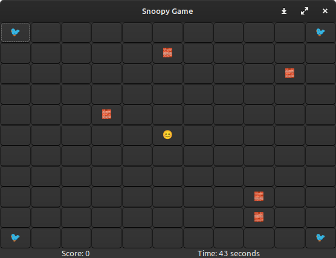

# Snoopy Game

## Overview

Snoopy Game is a simple terminal-based game implemented in C using the GTK library. The objective of the game is to control Snoopy, represented by a smiley face, to capture all the birds located in the corners of the grid while avoiding randomly placed walls.



## Features

- Move Snoopy using arrow keys to navigate the grid.
- Capture birds by moving Snoopy onto their positions.
- Avoid walls randomly placed on the grid.
- Score is incremented for each captured bird.
- Time counter displayed, and the game ends after a specified duration.

## How to Play

1. Use the arrow keys (Up, Down, Left, Right) to navigate Snoopy.
2. Capture birds by moving Snoopy onto their positions.
3. Avoid walls to prevent obstacles in Snoopy's path.
4. The game ends when all birds are captured or when the time runs out.

## Dependencies

- GTK Library

## Installation  

1. Install the GTK library on your system.
   ```bash
   # Example for Ubuntu
   sudo apt-get install libgtk-3-dev

# Using GTK for Graphical User Interface

GTK (GIMP Toolkit) is a powerful multi-platform toolkit for creating graphical user interfaces. It is commonly used for developing desktop applications with GUI components. Here's a brief overview of how GTK was used in the Snoopy Game:

## GTK Components Used

### GtkWindow

The `GtkWindow` widget represents the main application window. It is the top-level container for other GTK widgets.

### GtkGrid

The `GtkGrid` widget provides a container for organizing other widgets in a grid layout. In the Snoopy Game, it was used to arrange the buttons (representing the grid cells) in a two-dimensional grid.

### GtkButton

The `GtkButton` widget represents buttons that users can interact with. In the Snoopy Game, buttons were used to create the grid cells, each containing a label representing the game elements (smiley face, birds, walls).

### GtkLabel

The `GtkLabel` widget is used to display text. In the Snoopy Game, it was used to show the score and remaining time on the screen.

### Signal Handling with g_signal_connect

`g_signal_connect` is a function used to connect signals (events) to callback functions. In the Snoopy Game, it was employed to connect the arrow key presses to the `on_key_press` callback function, allowing the game to respond to user input.

### Timer with g_timeout_add_seconds

`g_timeout_add_seconds` is a function that invokes a callback function periodically, providing a way to implement time-related functionality. In the Snoopy Game, it was used to update the remaining time every second.

## Compiling GTK Programs

To compile C programs using GTK, you need to link against the GTK library. Here's an example compilation command:

```bash
gcc snoopy_game.c -o snoopy_game `pkg-config --cflags --libs gtk+-3.0`
```

## Run
```bash
./snoopy_game
```

## MADE BY
Ibtissam BENABID [](https://github.com/BenabidIbtissam)\
Achraf HARDIZI [](https://github.com/R0gueCS)

## Additional ressources
[GTK Documentation](https://docs.gtk.org/gtk3/)
